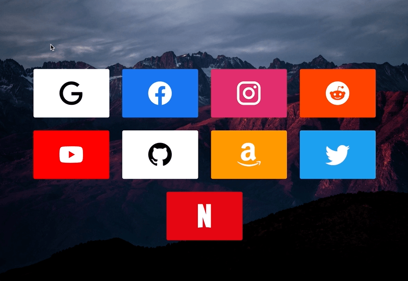

<h1 align="center">
   
  
  
Cards

</h1>

<h4 align="center">A simple start page with cards based on <a href="https://github.com/shrek-gabe-itch/StartPage">shrek-gabe-itch/StartPage</a></h4>

  <a href="#key-features">Key Features</a> •
  <a href="#built-with">Built With</a> •
  <a href="#license">License</a>

  

---

## Key Features

* Deploy easily with Docker
* Customize title, background and every card

## Built With

This software uses the following open source packages:

- [Javascript](https://www.javascript.com/)
- [Handlebars](https://handlebarsjs.com/)

## License

This project is licensed under the GNU GPLv3 License - see the [LICENSE.md](LICENSE.md) file for details
